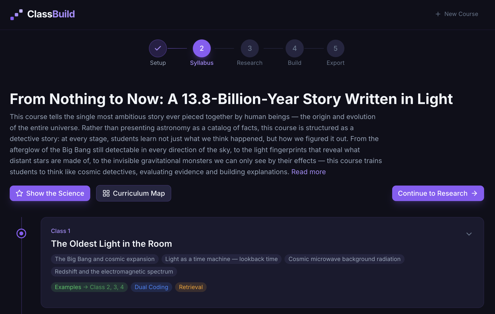

<!--
  keywords: ai course generator, university course builder, ai education, learning science, quiz generator, slide generator, curriculum builder, edtech, prompt engineering, claude, anthropic
  homepage: https://classbuild.ai
  cli: scripts/generate-course.ts
  llm-txt: https://classbuild.ai/llm.txt
  repository: https://github.com/jtangen/classbuild
-->

# ClassBuild

**One topic in. A complete course out.** Grounded in how humans actually learn.

[**Try it live at ClassBuild.ai**](https://classbuild.ai) · [LLM-readable docs](/llm.txt)



---

## What is ClassBuild?

Describe your subject and ClassBuild produces a full course: interactive chapters with embedded widgets, gamified quizzes with confidence calibration, PowerPoint slides with speaker notes, AI-narrated audiobooks, infographics, and a teaching pack — all woven with five evidence-based learning principles.

## What does ClassBuild produce per chapter?

- Interactive HTML reading with embedded visualizations and callout boxes
- Gamified practice quiz with confidence calibration, streaks, and achievements
- In-class quiz (5 shuffled versions + answer keys)
- PowerPoint slides with speaker notes
- AI-narrated audiobook (ElevenLabs)
- AI-generated infographic (Gemini)
- Teaching pack: discussion starters, activities, and current events hooks
- Research dossier with sources and synthesis notes

## How do I install ClassBuild?

```bash
git clone https://github.com/jtangen/classbuild.git
cd classbuild
npm install
npm run dev
```

Open [localhost:5173](http://localhost:5173) and enter your API key on the Setup page.

**Bring Your Own Key** — ClassBuild runs entirely in your browser. Your API keys are never sent to any server.

## What API keys do I need?

| Key | Required | Purpose |
|-----|----------|---------|
| Anthropic Claude | Yes | Course generation (all stages) |
| ElevenLabs | No | Voice narration |
| Google Gemini | No | AI-generated infographics |

## How does ClassBuild work?

ClassBuild is a six-stage pipeline:

1. **Setup** — Define your topic, audience level, chapter count, and preferences
2. **Syllabus** — Claude designs the full course arc: chapter narratives, key concepts, and learning science annotations
3. **Research** — Web search gathers real-world sources and examples to ground every chapter
4. **Build** — Generate all materials live: chapters, quizzes, slides, audio, and infographics stream in real time
5. **Export** — Download as ZIP, PowerPoint, or publish as a standalone course viewer site

Four visual themes (Midnight, Classic, Ocean, Warm) carry through every output — chapters, quizzes, slides, and the published course viewer.

## How do I generate a course from the command line?

The ClassBuild CLI generates complete courses from the command line — no browser required. Ideal for batch-building entire programs or course catalogues.

```bash
ANTHROPIC_API_KEY=sk-... npx tsx scripts/generate-course.ts \
  --topic "The Psychology of Prejudice" \
  --chapters 12 \
  --level advanced-undergrad \
  --theme midnight \
  --length comprehensive \
  --notes "University of Queensland, Australia. Use international and Australian examples." \
  --output ./output/prejudice
```

Set `ELEVENLABS_API_KEY` and `GEMINI_API_KEY` as environment variables for audio and infographics.

## What does each CLI flag do?

| Flag | Default | Description |
|------|---------|-------------|
| `--topic` | *(required)* | Course topic |
| `--chapters` | `12` | Number of chapters |
| `--level` | `advanced-undergrad` | `general-public`, `professional`, `advanced-undergrad` |
| `--theme` | `midnight` | `midnight`, `classic`, `ocean`, `warm` |
| `--length` | `standard` | `concise`, `standard`, `comprehensive` |
| `--widgets` | `3` | Interactive widgets per chapter |
| `--cohort` | `60` | Expected class size |
| `--environment` | `lecture-theatre` | `lecture-theatre`, `collaborative`, `flat-classroom`, `online-hybrid` |
| `--notes` | — | Additional context for the AI (audience, tone, specific topics) |
| `--voice-id` | — | ElevenLabs voice ID for audiobook narration |
| `--syllabus` | — | Path to existing syllabus.json (skip regeneration) |
| `--stop-after` | — | `syllabus` or `research` — stop early for review |
| `--no-publish` | `false` | Skip course viewer assembly |
| `--specific-topics` | — | Comma-separated topics to include |
| `--avoid-topics` | — | Comma-separated topics to exclude |
| `--textbook` | — | Reference textbook for alignment |
| `--output` | `./output` | Output directory |

See 6 example courses built with the CLI at [courses.classbuild.ai](https://courses.classbuild.ai).

## How do I use ClassBuild's prompt library in my own project?

ClassBuild's 11 prompt builders in `src/prompts/` can be imported directly. Each returns a system prompt and user message for the Anthropic messages API:

```typescript
import { buildSyllabusPrompt, parseSyllabusResponse } from 'classbuild/src/prompts/syllabus';
import { buildChapterPrompt, buildChapterUserPrompt } from 'classbuild/src/prompts/chapter';
import { buildResearchUserPrompt, RESEARCH_SYSTEM_PROMPT } from 'classbuild/src/prompts/research';
import { buildPracticeQuizPrompt } from 'classbuild/src/prompts/practiceQuiz';

// Example: generate a syllabus
const { system, userMessage } = buildSyllabusPrompt(setup);
const response = await anthropic.messages.create({
  model: 'claude-sonnet-4-6',
  system,
  messages: [{ role: 'user', content: userMessage }],
  max_tokens: 16000,
});
const syllabus = parseSyllabusResponse(response.content[0].text);
```

**Available prompt builders:**

| File | Exports | Purpose |
|------|---------|---------|
| `syllabus.ts` | `buildSyllabusPrompt()`, `parseSyllabusResponse()` | Course architecture with learning science |
| `chapter.ts` | `buildChapterPrompt()`, `buildChapterUserPrompt()` | Interactive HTML chapter |
| `research.ts` | `RESEARCH_SYSTEM_PROMPT`, `buildResearchUserPrompt()` | Research dossier with web search |
| `slides.ts` | `buildSlidesPrompt()`, `buildSlidesUserPrompt()` | PowerPoint slide content |
| `practiceQuiz.ts` | `buildPracticeQuizPrompt()`, `buildPracticeQuizUserPrompt()` | Gamified practice quiz |
| `inClassQuiz.ts` | `buildInClassQuizPrompt()`, `buildInClassQuizUserPrompt()` | In-class quiz (5 versions) |
| `activities.ts` | `buildActivitiesPrompt()`, `buildActivitiesUserPrompt()` | Classroom activities |
| `discussion.ts` | `buildDiscussionPrompt()`, `buildDiscussionUserPrompt()` | Discussion starters |
| `audioTranscript.ts` | `buildAudioTranscriptPrompt()`, `buildAudioTranscriptUserPrompt()` | Audiobook narration |
| `learningObjectives.ts` | — | Learning objectives (Bloom's taxonomy) |
| `infographic.ts` | `buildInfographicMetaPrompt()`, `buildInfographicMetaUserPrompt()` | Infographic briefs |

## What learning science does ClassBuild apply?

These aren't buzzwords. Each principle draws on decades of cognitive science, and ClassBuild weaves all five into every chapter, quiz, and activity it generates:

- **Retrieval practice** — Built-in "Think About It" prompts test recall before delivering answers; quizzes track accuracy alongside confidence
- **Interleaving** — Related concepts are mixed across practice sets, not blocked together
- **Dual coding** — Every concept gets both verbal and visual representation through interactive widgets, diagrams, and infographics
- **Concrete examples** — Abstract theories are grounded in vivid, real-world cases — named people, specific studies, tangible scenarios
- **Elaboration** — Learners connect new material to what they already know through discussion starters, thought experiments, and cross-chapter callbacks

The syllabus stage annotates every chapter with the specific principles it emphasizes, so instructors can see exactly how the science is wired in.

## Built with

React 19 · Vite 7 · TypeScript 5.9 · Tailwind CSS 4 · Zustand · Framer Motion · Claude Opus 4.6 / Sonnet 4.6 / Haiku 4.5 · ElevenLabs · Gemini

Built with Claude for the [Anthropic Hackathon](https://docs.google.com/forms/d/e/1FAIpQLSdAmDqfWux_oP_E55aSaXRahq6lkSi3jBWG4PlMOmhgVUhg-w/viewform) (Feb 2026).

## License

[MIT](LICENSE)
